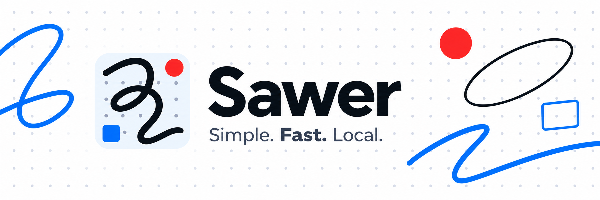

  

# Sawer

Sawer is a simple, fast, native whiteboard for Windows and Linux. It is built
around local files: each board is one portable `.sawer` file that you can keep
in any ordinary folder, copy, move, and share.

> **Status:** Sawer 0.9.0 is prerelease software. A Windows AMD64 release
> workflow and a Linux x86_64 executable/AppImage build workflow are configured.

## Download

### Installer (recommended)

When a Windows release is available, download `Sawer-Setup.exe` from the
[GitHub Releases page](https://github.com/SeifKaroui/sawer/releases), run it,
and choose **Install**. Sawer installs for your Windows account without an
administrator prompt, adds Start Menu and desktop shortcuts, registers
`.sawer` boards, and opens automatically. No account or restart is required.

### Portable version

Download `Sawer-Portable.exe` from the same release if you prefer not to
install anything. Save it anywhere and run it directly; the application is
self-contained and has no companion-file requirement.

Each release includes `SHA256SUMS.txt`. Verify either download from PowerShell
with:

    Get-FileHash .\Sawer-Setup.exe -Algorithm SHA256
    Get-FileHash .\Sawer-Portable.exe -Algorithm SHA256

Compare the result with the matching line in `SHA256SUMS.txt`. Windows binaries
are not yet code-signed, so SmartScreen may show a warning.

### Linux downloads

The **Linux release** workflow generates two x86_64 downloads:

- **Sawer-x86_64.AppImage** bundles the C++ runtime libraries and needs no
  application installation.
- **Sawer** is the plain executable. SDL and application assets are embedded,
  but compatible system C++ runtime libraries are required.

Until Linux assets are published, download the
`Sawer-<version>-Linux-x86_64` artifact from a successful workflow run and
extract it. In that directory, verify the files, make the chosen download
executable, and run it:

    sha256sum --check SHA256SUMS-Linux-x86_64.txt
    chmod +x Sawer-x86_64.AppImage
    ./Sawer-x86_64.AppImage

For the plain executable, use `chmod +x Sawer` followed by `./Sawer`.
Both builds target glibc-based Linux distributions with Ubuntu 22.04 as the
build baseline and require a working Vulkan driver. AppImage does not bundle
graphics drivers. On systems that restrict FUSE mounting, run
`./Sawer-x86_64.AppImage --appimage-extract-and-run`.

The workflow runs Debug and Release checks on X11 and Wayland with software
Vulkan, then checks both downloads on Ubuntu 24.04. CI artifacts do not
automatically publish a Linux release.

## Built around the essentials

- **Simple.** A focused, mouse-first drawing experience with only the tools
  needed for freehand notes and basic shapes—without a sprawling feature set.
- **Fast.** Native rendering keeps drawing, editing, panning, and zooming
  responsive, including on large boards and high-DPI displays.
- **Portable.** A board is a self-contained file, not a project or managed
  workspace. Open it from anywhere and take it with you.
- **Private.** There are no accounts, cloud services, telemetry, or database.
  Your boards remain ordinary files under your control.

## What works today

- Draw freehand strokes, lines, rectangles, and ellipses with configurable
  colors, widths, and shape fills.
- Select, marquee-select, move, resize, duplicate, delete, and restyle board
  objects with undo and redo.
- Copy and paste selections between boards, or paste PNG/BMP images from
  the clipboard. Image data stays inside the board file.
- Create, open, save, autosave, and safely recover independent `.sawer`
  boards. Recent boards appear on Home.
- Pan a finite board and zoom beneath the cursor. Rendering is designed for
  large boards and high-DPI displays.
- Run natively with SDL GPU using Direct3D 12 on Windows or Vulkan on Linux.

## In progress or deferred

- SDL Render fallback, complete device-loss recovery, and broad mixed-DPI
  validation are still in progress.
- Linux Flatpak packaging and broad distribution/hardware validation remain future milestones.
- Pen, touch, text, PDF import, sync, collaboration, and plugins are
  intentionally deferred until after the mouse-first 1.0 release.

## Quick start

### Build and run

Install the [requirements](#requirements), then configure, build, test, and
run a debug build on Windows:

    meson setup build --buildtype=debug -Dsawer_werror=true
    meson compile -C build
    meson test -C build --print-errorlogs
    build/Sawer.exe

On Linux, use the same `build` directory and run `build/Sawer`. See
[Build on Linux](#build-on-linux) for the complete commands.

### Create and save a board

1. Sawer starts with a new, unsaved **Untitled** board. Draw with the Pencil,
   then choose **Save As** to select any destination. You can also choose
   **New board** from Home.
2. To reopen it later, use **Open board**, click it from Home’s recent-board
   list, or pass the file path when launching Sawer.
3. After the first save, Sawer autosaves completed actions after roughly one
   second. Press `Ctrl+S` to flush immediately. An unsaved Untitled board stays
   in memory until you choose a file; Sawer prompts before leaving unsaved work.

Create a new board at a chosen path, or open an existing one:

    build/Sawer.exe drawings/ideas.sawer

## Controls

| Task | Control |
| --- | --- |
| Pan | `H` then left-drag, middle-drag, or `Space` + left-drag |
| Zoom | Mouse wheel beneath the cursor; `Ctrl+-` / `Ctrl++` at the viewport center |
| Reset zoom to 100% | `Ctrl+0` |
| Choose Pencil / Line / Rectangle / Ellipse | `P` / `L` / `R` / `E` |
| Draw | Left-drag with the current tool |
| Constrain a line or shape | Hold `Shift` while drawing |
| Toggle shape fill | `F` |
| Select and edit objects | `V`, then click or drag a marquee |
| Move or resize a selection | Drag selected objects or their handles |
| Select all / nudge selection | `Ctrl+A` / arrow keys (`Shift` for a larger step) |
| Copy / Cut / Paste | `Ctrl+C` / `Ctrl+X` / `Ctrl+V` |
| Duplicate / delete selection | `Ctrl+D` / `Delete` |
| Undo / redo | `Ctrl+Z` / `Ctrl+Shift+Z` or `Ctrl+Y` |
| Cancel the active gesture | `Escape` |
| Choose color / adjust width | `1`–`7` / `[` and `]` |
| New / Open / Save / Save As | `Ctrl+N` / `Ctrl+O` / `Ctrl+S` / `Ctrl+Shift+S` |
| Rename the current board | Rename icon, File → Rename, or `F2`; `Enter` confirms and `Escape` cancels |
| Toggle theme | `T` |

The toolbar also provides file, drawing, style, history, zoom, Home, and
theme controls. Hover a control to see its shortcut and purpose. The board is
finite and clamped to +/-1,000,000 logical units.

Dark mode also adapts white and default light board backgrounds to graphite.
On these boards, neutral black ink becomes off-white and white ink/fills become
graphite. Other colors, colored backgrounds, and images keep their colors.
This changes the display only: saved colors stay intact and return in light mode.

## Your boards stay yours

Save a board wherever you like, then copy, move, back up, or share that one
file whenever you need to. Sawer does not require an account or take ownership
of a folder. It autosaves your completed work and makes saving problems clear
so you can choose what to do next.

## Large boards

Sawer is built to keep normal frame work tied to what is visible, rather than
the total size of a board. Viewport queries, retained geometry, zoom-adaptive
stroke detail, and bounded caches support 100,000 mixed objects, one million
freehand points, thousands of visible objects, and extreme zoom transitions in
the automated regression workload.

## Requirements

- Meson 1.7 or newer and Ninja.
- Python 3.10 or newer for Meson and the build-time asset tools.
- A C++20 compiler: MSVC, GCC, or Clang.
- CMake 3.28 or newer. Meson uses it internally to build SDL3 because SDL3
  does not provide an upstream Meson definition.
- Network access during the first configuration and build to download pinned
  dependencies and embedded fonts.

Git is not required to configure or build Sawer. SDL3 is linked statically on
Windows and Linux. Windows MinGW release and development builds also link the
GCC C++ runtime statically, so Sawer can be distributed as one executable
without third-party DLLs. Linux builds embed SDL3 but use the operating
system’s standard display, graphics, audio, and C runtime libraries.

## Build on Windows

For a debug build:

    meson setup build --buildtype=debug -Dsawer_werror=true
    meson compile -C build
    meson test -C build --print-errorlogs

For an optimized build, reconfigure the same directory:

    meson setup build --wipe --buildtype=release -Dsawer_werror=true
    meson compile -C build
    meson test -C build --print-errorlogs

## Build on Linux

For a debug build:

    meson setup build --buildtype=debug -Dsawer_werror=true
    meson compile -C build
    meson test -C build --print-errorlogs

For an optimized build, use `meson setup build --wipe --buildtype=release`.

On Ubuntu 22.04/24.04, install the display and graphics development packages
listed in [the Linux pipeline](https://github.com/SeifKaroui/sawer/blob/main/.github/workflows/linux-release.yml).
Headless checks can run without a display:

    meson test -C build --suite headless --print-errorlogs

The `graphics` suite needs a functioning X11 or Wayland session and Vulkan.
The `performance` suite should run on real supported graphics hardware.

## Run and diagnose

Run the Windows debug executable:

    build/Sawer.exe

Close the window normally to exit. Automated checks and diagnostics include
the following; rendering checks can briefly open visible windows:

    build/Sawer.exe --version
    build/Sawer.exe --third-party-notices
    build/Sawer.exe --smoke-test
    build/Sawer.exe --gpu-info
    build/Sawer.exe --render-test
    build/Sawer.exe --board-loading-test
    build/Sawer.exe --rendering-performance-test
    build/Sawer.exe --export-diagnostics diagnostics.log

`--third-party-notices` prints the complete license text embedded in the
executable; the same text is available from the toolbar's About button.
`--smoke-test` creates a hidden SDL window and exits. `--gpu-info` prints the
selected GPU backend, adapter, and driver version. `--render-test` presents
three frames before exiting. `--export-diagnostics` exports the local log and
current GPU startup diagnostics without opening a visible window.

`--rendering-performance-test` checks retained navigation, incremental edits,
stroke detail reuse and all procedural grid styles. Implementation bounds and
validation results are in [rendering performance](docs/rendering-performance.md).
Image preparation and loader measurements are documented in
[board loading performance](docs/board-loading-performance.md).

## Package

After a Release build, create a portable archive through Meson:

    meson compile -C build package

The archive is written into `build/` and contains the statically linked
application, this README, `assets/banner.png`, technical documentation under
`docs/`, linked shader references, and
[third-party notices](THIRD_PARTY_NOTICES.md). Extract it anywhere and run
`Sawer.exe`; no installer is required. Linux builds produce a `.tar.gz` with
the same contents, but still need compatible operating-system libraries.
The local archive is separate from the Windows installer workflow.

The Windows release workflow is configured to publish `Sawer-Setup.exe` as
the recommended one-click installer and `Sawer-Portable.exe` as the no-install
alternative.
Both come from the same executable. Tag runs generate SHA-256 checksums and
GitHub build-provenance attestations. Maintainer steps are documented in
[docs/releasing.md](docs/releasing.md).

## Development

The project uses C++20, Meson, Ninja, SDL3, SDL GPU, SDL_ttf, and
nlohmann/json. Production code is organised under `src/`; automated unit and
application checks are under `tests/`. `meson test` runs the default test set;
performance regression checks are defined in Meson’s `performance` suite.

The board format and inspection tool are described in
[docs/file-format.md](docs/file-format.md). The format tool is built from
source and is not included in the current application downloads.

Third-party licenses are in [THIRD_PARTY_NOTICES.md](THIRD_PARTY_NOTICES.md).
